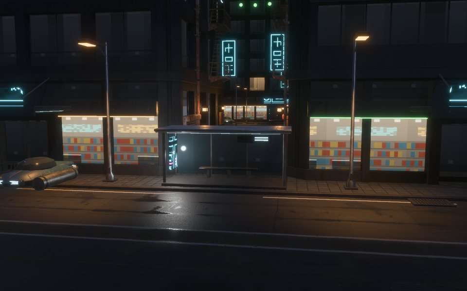
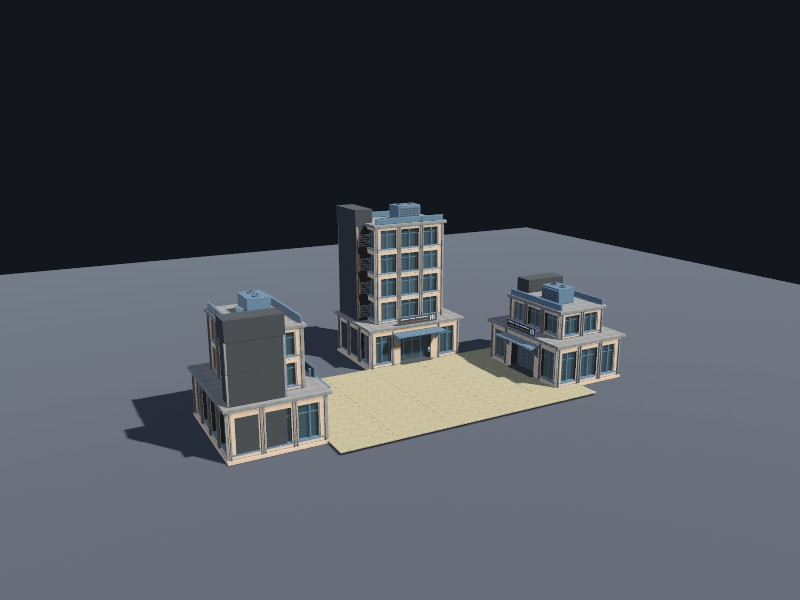
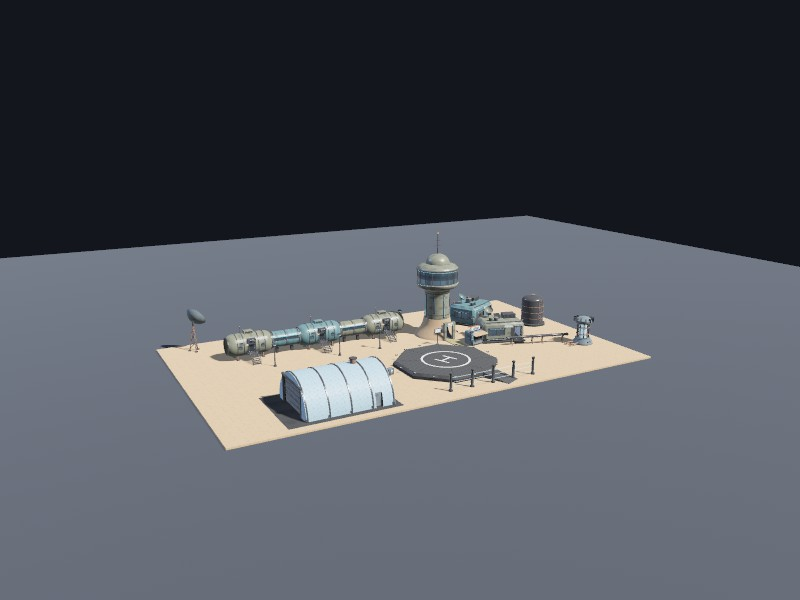

# ashlar

Procedural buildings and materials for Rust games.
We describe a building as ordinary Rust data and its materials as graphs,
a content step bakes both into files, and a Bevy game loads those files
with levels of detail, collision proxies and rooms.

**[Live demo](https://jedimemo.github.io/ashlar/demo/)** ·
**[Manual](https://jedimemo.github.io/ashlar/book/)** ·
**[API docs](https://jedimemo.github.io/ashlar/api/ashlar/)**

| | |
| --- | --- |
|  |  |
|  |  |

Every building above is a Rust function, and every surface is a material graph.
Nothing in them is a model file or a painted texture.

## What it is

A game with a city in it needs a lot of buildings,
and every one of them has to be modelled, textured, given collision, cut into levels of detail and exported.
ashlar makes a building a value instead: parts made of solids, placed as instances,
with material slots, sockets and rooms.
Because it is data, a loop places a hundred storeys and a seed lays out a city.

There is no macro language and no architectural style built in.
The kits in this repository are examples to copy, not a look you inherit.

```rust
use ashlar::{Building, Element, Geometry, Instance, Part, Pose};

let bay = Part::builder("example:bay")
    .element(Element::new(
        "shell",
        Geometry::cuboid([4.0, 3.0, 0.3])
            .subtract(Geometry::cuboid([1.2, 2.2, 0.5]).placed(Pose::at([1.4, 0.0, -0.1]))),
        "wall",
    ))
    .build()?;

let wall = Building::builder("example:wall")
    .part(bay)
    .material("wall", "library:brick")
    .instance(Instance::new("first", "example:bay"))
    .instance(Instance::new("second", "example:bay").placed(Pose::at([4.0, 0.0, 0.0])))
    .build()?;
```

The element names a slot, the building binds it to `library:brick` from the default library of forty surfaces,
and the cutter runs through the wall, so each bay has a door-sized opening.
[Getting started](docs/guide/getting-started.md) takes it from here to the screen.

## Two halves

The *content step* is a small binary in your game's repository that runs when content changes.
It meshes every building at every level of detail and bakes every material to KTX2,
and it is the only place the geometry kernel and the graph engine are linked.

The *game* adds `AshlarPlugin`, spawns an `AshlarBuilding`, and gets meshes, distance bands, collision proxies and rooms.
It links neither the kernel nor the graph engine, so a shipped game has no C++ toolchain in its build
and spends no frame time baking.

| Crate | What it is | Half |
| --- | --- | --- |
| [`ashlar`](crates/ashlar/README.md) | The domain: parts, instances, slots, sockets, rooms, terrain fitting, levels of detail, the `.ashlar` file | both |
| [`ashlar-surface`](crates/ashlar-surface/README.md) | The material vocabulary both halves share | both |
| [`ashlar-strands`](crates/ashlar-strands/README.md) | Grass, fur and moss from a baked strand set | game |
| [`ashlar-bevy`](crates/ashlar-bevy/README.md) | The Bevy adapter: `AshlarPlugin` for games, tool features for authoring | game |
| [`ashlar-manifold`](crates/ashlar-manifold/README.md) | The mesher, over the native [Manifold](https://github.com/elalish/manifold) kernel | content |
| [`ashlar-material`](crates/ashlar-material/README.md) | Material graphs, the default library, the bake and the KTX2 export | content |
| [`ashlar-content`](crates/ashlar-content/README.md) | The content step as a library | content |

## Try it

You need Rust 1.96 or newer and [`just`](https://github.com/casey/just).
Anything that meshes also needs `cmake`, a C++ compiler and Git, because the first build compiles the Manifold kernel,
and on Linux, Bevy's usual `libasound2-dev libudev-dev libwayland-dev libxkbcommon-dev pkg-config`.

```sh
just preview --scene corporate-block                                   # the authoring tool
just preview --scene metropolis --night --focus 30,2,10 --zoom 0.03    # a street, by night
just preview --scene sheet-brick                                       # one material, twelve ways
cargo run --release -p integration-content                             # the template: bake a village
cargo run --release -p integration-game                                # and play it
```

Nothing is on crates.io yet, so a game depends on the repository through git:

```toml
[dependencies]
ashlar-bevy = { git = "https://github.com/JedimEmO/ashlar" }   # the game
ashlar-content = { git = "https://github.com/JedimEmO/ashlar" } # the content step
```

`ashlar-bevy` tracks one Bevy release at a time, and today that is 0.19.
[Shipping to a game](docs/guide/integration.md) walks the whole path.

## Finding your way around

| Where | What |
| --- | --- |
| `crates/` | The seven crates, each with a README and its own examples |
| `examples/showcase` | The kits: corporate, the dark city, the sci-fi frontier, a house with an interior |
| `examples/integration-content`, `examples/integration-game` | The split a game copies: a content crate and a game crate |
| `examples/web` | The browser demo |
| `tools/ashlar-preview` | The authoring tool |
| `docs/` | The manual: guides, the [decisions](docs/adr/README.md) behind the design, and material references |
| `.agents/skills` | Two compact references, for geometry and for materials, written for AI agents and readable by people |

`just --list` shows every command, and `just ci` runs what continuous integration runs.
Inside this workspace, `.cargo/config.toml` enables `+sse4.1,+fma` on x86-64,
which takes about 14% off a bake and changes no baked byte.
For older CPUs and Anaconda compiler environments, see the
[build prerequisites](docs/guide/getting-started.md#what-you-need).
`just ci` also needs [`cargo-deny`](https://github.com/EmbarkStudios/cargo-deny)
(`cargo install cargo-deny --locked`).

## Licence

MIT or Apache-2.0, at your option.
