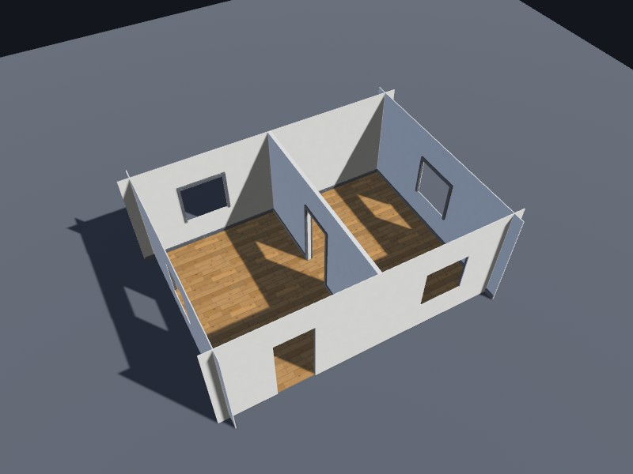

# A tour of the kits

The showcase in `examples/showcase` is a set of kits built with nothing but the public API.
They are there to be read and copied, not to be a style you inherit.
A game brings its own look; what it takes from here is how a kit is put together.

Every scene below opens in the preview with `just preview --scene <name>`,
and most of them are in the [live demo](https://jedimemo.github.io/ashlar/demo/) as well.

## The study pieces

`facade`, `entrance`, `outpost` and `office` are where the recipe API was first worked out.
A facade bay is one chamfered panel with its openings subtracted and trim added as further elements,
and the outpost and the office are those bays chained by sockets into a one- and a three-storey building.
They are small enough to read in one sitting,
and [`references/walkthrough.md`](https://github.com/JedimEmO/ashlar/blob/main/.agents/skills/ashlar-geometry/references/walkthrough.md)
in the geometry skill takes the facade apart element by element.

`basic` is the primitive fixture: one of every shape, drawn in diagnostic colours.
It exists for tests and for checking a mesher change at a glance.

## The corporate kit


`corporate`, `corporate-annex` and `corporate-block` are the kit in `corporate.rs`:
a double-height public podium, a lobby, and curtain bays on a four-metre grid, one ring per storey,
with a dark service riser up one side and plant and rails on the roof.
Glazing channels, pressure caps and transoms frame the panes; the projecting sills and cap courses
have drip edges. The lobby canopy has fascia, soffit ribs and supports, and the roof plant has
fan cowls, grilles and a coupled duct.
Every bay is one part placed many times, so a forty-storey tower is a few dozen unique meshes.

`corporate-merged` and `corporate-block-merged` are the same buildings merged by storey.
A merged building unions each storey into one solid, which removes the seams between parts
and makes the storey the unit a hit re-meshes; shift-click one in the preview to blast a hole in it.

## The house



`interior` is a two-storey house built the way [ADR 0005](../adr/0005-merged-geometry-and-damage.md) says to build an interior.
Walls, floors, liners and partitions are *added* elements, and only the openings are subtracted.
This may look like the long way round, when carving rooms out of a solid mass would be shorter to write,
but a collision proxy is convex, so the proxy of a carved mass would fill the room it was carved from.
Window surrounds, projecting sills, door casings and dark metal roof edging finish the exterior.
Inside, skirting stops at the doorways and the partition has a casing on each side.
Open it with `--hide-exterior --max-storey 1` to walk its rooms from above.

## The sci-fi kit


`scifi-kit`, `scifi-outpost` and `scifi-colony` are a frontier kit in the idiom of Anarchy Online and Star Wars Galaxies,
in `scifi.rs` and `scifi/`.
Adobe domes, capsule habitats on stilts, a flared hab tower, moisture vaporators, tube walkways and prefab modules,
most of them lathe-turned with `Geometry::revolve`.
The enterable ones carry furnished interiors with rooms and portals,
and a building varies a piece by overriding a slot's graph parameters on an instance,
a faction's hull colour or a weathered hut, never by copying geometry.
Dark metal and stained concrete, corporate blade signs, cyan readouts and amber warning lights
connect the colony to the city. Braced supports, docking collars, framed openings and service covers
belong to the shared parts; consoles, bunks, lockers and galleys carry their own fittings.
`scifi::outpost_seeded` and `scifi::colony_seeded` select from a finite palette and shared utility
packages. Fine collar sectors disappear at distance while the luminous accents remain.

## The dark city


`city-kit`, `city-block`, `city-alley`, `city-tower`, `city-landmark` and `metropolis` are the kit in `city/`,
and the largest example in the repository.
It takes the corporate kit's facade language tall and dark:
a deep wall of stained concrete, recessed windows in steel frames, a strip light in each window's head
and a lit line down each chamfered corner.

A tower is dressed in one of three styles, each with its own plans for its three tiers.
*Frame* towers have punched windows between tapered fins, *band* towers are brutalist ribbons between precast spandrels,
and *cage* towers are floor-to-ceiling glass behind a deep concrete frame.
The styles differ in massing too, so they read apart at a kilometre and not only up close:
a frame tower keeps a heavy lower tier, a band tower is a long slab on a short podium, and a cage steps in early to a slim shaft.
The generator picks a style per tower from its seed, and avoids matching neighbours across an alley.

Every setback is a built terrace, with a cornice, a coped and lit parapet and planters,
and every tower ends in a designed crown its topper stands on:
a louvred penthouse, lit steps, a tapered lantern, or an open ring of blades.
At street level a tower stands on a podium of piered shopfronts under a lit fascia,
with glazed sliding doors in a deep portal under a canopy.

The landmark in the middle of a city is the one building every skyline shot is composed around,
so it is designed as one.
It stands on a double-height colonnade over a composed forecourt,
glazed sky floors mark both of its setbacks,
and it ends in a tall lit lantern the spire grows out of.

Every storey is still one part per footprint, and every one is an office a player can walk into:
a lift lobby at the core, a glazed meeting room, desk benches with chairs, a server room,
and ceiling panels that light it.
A tower's ground floor is a lobby, with reception, seating and security gates on the way to the lifts.
All of it is interior, so it drops at the first coarser level of detail.

Between a lot's four towers run back alleys:
gutters, service shutters and loading bays, fire escapes with open grated landings,
air-conditioners, pipes, caged lamps, neon blade signs and lanterns strung overhead.
The sidewalks have lowered crossings, benches, tram shelters, news terminals and cycle stands,
and some lots are night markets of stalls and noodle counters.
Which pieces dress which alley and block varies by seed, and none of it is per-instance geometry.

What varies from storey to storey is material, not geometry.
Which offices are lit, which storeys are dark, and which neon a building wears on its crowns and corners,
are all instance overrides of a handful of definitions,
so a city of thousands of storeys costs a few dozen meshes and a few dozen materials.
That may sound too good to be true for a city this size, and it does have a price:
the 4 x 4 `metropolis` draws about 4.3 million triangles at full detail,
which is why that level only ever draws within sixty metres of the camera,
and why a test in `examples/showcase/tests/city.rs` holds the city to its budget at every level.


Look at it by night:

```sh
just preview --scene metropolis --night
just preview --scene city-alley --night --zoom 0.35 --pitch 0.12
```

`metropolis` is `city::metropolis(seed, blocks)`, and the same seed lays the same city.
It is also the scene the content step bakes to measure levels of detail:
[ADR 0006](../adr/0006-baked-buildings-and-lod.md) has the numbers.

## The materials

Every surface in the showcase comes from `ashlar-material`'s default library of forty surfaces,
bound through `examples/showcase/src/library.rs`,
which adds the kits' own definitions on top: the corporate stone, the dark city's windows, neon and wet roads.
A definition there is almost always a library graph with different parameters, not a new graph.
`sheet-<name>` shows any library surface on its own.
